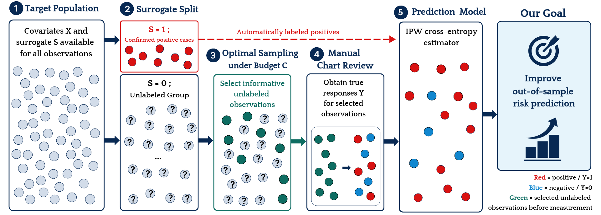

# Optimal Sampling for Healthcare Stroke Data

This repository provides the R implementation of the healthcare stroke data application in:

**Park, S. and Lee, S.-H.**  
*Surrogate-assisted optimal sampling for risk prediction under measurement constraints.*

The study proposes a **surrogate-assisted optimal sampling framework for risk prediction under measurement constraints**. When true responses are costly to obtain, the proposed method selectively measures informative observations and estimates the prediction model using an inverse-probability-weighted cross-entropy loss.

The sampling design is constructed to directly improve out-of-sample binary risk prediction by minimizing the leading contribution to the expected cross-entropy loss.

This repository applies the proposed method to the **Healthcare Stroke Prediction Dataset**, representing a rare-outcome setting in which no surrogate information is available.

## Overview



The general framework assumes that covariates \(X\) and a surrogate indicator \(S\) are available for all observations, while the true binary response \(Y\) is costly to obtain.

The procedure consists of:

1. **Target Population**  
   Covariates \(X\) and the surrogate \(S\) are available for all observations.

2. **Surrogate Split**  
   Observations with \(S=1\) are confirmed positive cases whose responses are automatically identified as \(Y=1\).  
   Observations with \(S=0\) form an unlabeled group whose true responses are initially unknown.

3. **Optimal Sampling under Budget \(C\)**  
   Informative observations are selected from the unlabeled group under a limited response measurement budget.

4. **Response Measurement**  
   The true responses \(Y\) are obtained for the selected observations.

5. **Prediction Model**  
   The prediction model is estimated using an inverse-probability-weighted cross-entropy loss.

The objective is to improve **out-of-sample risk prediction** while using the limited response measurement budget efficiently.

## Optimal Sampling without Surrogate Information

Although the general framework allows the use of a positive-only surrogate, the proposed optimal sampling method does not require a surrogate to be available.

In the healthcare stroke application, no surrogate information is available. We therefore set

```text
S = 0 for all observations
```

so that every observation initially belongs to the unlabeled group.

Under this setting, there are no automatically labeled positive observations. The surrogate-assisted framework consequently reduces to a **covariate-assisted optimal sampling design**, in which sampling decisions are determined using the observed covariates and a preliminary prediction model.

Thus, the stroke application illustrates that the proposed framework can be used both:

- when a positive-only surrogate is available, and
- when no surrogate information is available.

The latter is particularly relevant to the stroke data because stroke is a rare outcome, with a prevalence of approximately 5%.

## CE-based Optimal Sampling

Let \(p(x,\beta)\) denote the predicted probability of the binary response.

The proposed **CE method** constructs sampling probabilities to improve the out-of-sample prediction performance of the estimated model under a measurement budget \(C\).

A preliminary estimator is first obtained from a pilot sample. Based on this estimator and the available covariates, the contribution of each observation to the leading cross-entropy prediction risk is evaluated.

The sampling probabilities are then optimized under the measurement budget. Observations are sampled according to these probabilities, and the final prediction model is estimated using an inverse-probability-weighted cross-entropy loss.

The overall procedure is:

1. Obtain a preliminary estimator from a pilot sample.
2. Evaluate observation-specific contributions to the cross-entropy prediction risk.
3. Determine the optimal sampling probabilities under budget \(C\).
4. Sample observations according to the optimized probabilities.
5. Obtain the true responses of the selected observations.
6. Fit the prediction model using inverse-probability-weighted cross-entropy estimation.

Unlike sampling criteria based on parameter MSE, the proposed method directly targets **cross-entropy prediction loss**, which is aligned with binary risk prediction.

## Healthcare Stroke Dataset

The analysis uses the **Healthcare Stroke Prediction Dataset**, which contains demographic, clinical, and lifestyle information related to stroke risk.

The original dataset contains:

- Number of observations: `5,110`
- Number of variables: `12`
- Response variable: `stroke`

The response is defined as:

- `stroke = 1`: patient experienced a stroke
- `stroke = 0`: patient did not experience a stroke

The variables in the original dataset are:

- `id`
- `gender`
- `age`
- `hypertension`
- `heart_disease`
- `ever_married`
- `work_type`
- `Residence_type`
- `avg_glucose_level`
- `bmi`
- `smoking_status`
- `stroke`

### Data Source

https://www.kaggle.com/datasets/fedesoriano/stroke-prediction-dataset

## Data Preprocessing

The preprocessing procedure follows the healthcare stroke application in the study.

The analysis:

1. removes the `id` variable,
2. removes observations with unavailable `bmi` values,
3. removes the observation with `gender = "Other"`,
4. removes observations with `smoking_status = "Unknown"`,
5. converts categorical variables to factors, and
6. constructs a full-rank dummy-variable design matrix for prediction.

The original dataset contains `5,110` observations.

After removing:

- 201 observations with unavailable BMI,
- one observation with `gender = "Other"`, and
- observations with `smoking_status = "Unknown"`,

**3,425 observations** remain for analysis.

Among these observations, approximately **5.3%** experienced a stroke.

## Experimental Setting

For the stroke application, the surrogate indicator is defined as

```text
S = 0
```

for all 3,425 observations.

A pilot sample is first randomly selected to obtain preliminary estimators. The pilot observations are subsequently excluded from the evaluation sample.

The main experimental settings are:

- Pilot sample size: `m = 300`
- Remaining analysis sample size: `n = 3,125`
- Measurement budgets: `C = 200, 300, 400`
- Number of repetitions: `1,000`
- Surrogate indicator: `S = 0` for all observations

The following methods are evaluated:

- **CE**: proposed cross-entropy-based optimal sampling
- **MSE**: MSE-based optimal sampling
- **OSCA**: comparison method based on surrogate-assisted sampling
- **SRS**: simple random sampling
- **FULL**: estimator based on the full analysis sample, used as a benchmark

Because \(S=0\) for every observation in the stroke application, no surrogate information is available to OSCA. In this setting, OSCA reduces to the SRS-based estimator.

The prediction performance is evaluated using:

- Cross-entropy loss (CE)
- Mean squared error (MSE)
- Specificity (TN)
- Sensitivity (TP)
- Area under the ROC curve (AUC)

## Reproducibility

### Required R Packages

Install the required R packages before running the analysis:

```r
install.packages(c(
  "data.table",
  "caret",
  "nloptr",
  "snowfall",
  "pROC"
))
```

### Run the Analysis

The pilot sample size `m` and measurement budget `C` are supplied to `simulation.R` through command-line arguments.

For the experimental settings used in the study, run:

```bash
Rscript simulation.R 300 200
Rscript simulation.R 300 300
Rscript simulation.R 300 400
```

Each command performs the repeated sampling and model estimation procedure under the corresponding measurement budget and saves an `.RData` file:

```text
result-300-200.RData
result-300-300.RData
result-300-400.RData
```

After generating the result files, run:

```bash
Rscript summary.R
```

to calculate the prediction performance measures and summarize the results across repeated experiments.

## Directory and Codes

```text
.
├── README.md
├── framework.png
├── healthcare-dataset-stroke-data.csv
├── methods.R
├── simulation.R
└── summary.R
```

### `framework.png`

Illustrates the general **surrogate-assisted optimal sampling framework**.

The figure describes the full procedure from the target population and surrogate split to optimal sampling, response measurement, inverse-probability-weighted prediction model estimation, and the final goal of improving out-of-sample risk prediction.

### `healthcare-dataset-stroke-data.csv`

Contains the original **Healthcare Stroke Prediction Dataset** used in the real-data application.

### `methods.R`

Contains the statistical and numerical functions used to implement the proposed CE method and the comparison methods.

### `simulation.R`

Implements the main healthcare stroke data experiment.

### `summary.R`

Processes the output generated by `simulation.R` and evaluates predictive performance.

## Results

The healthcare stroke application evaluates whether the proposed optimal sampling strategy remains effective in a rare-outcome setting **without surrogate information**.

Because \(S=0\) for all observations, the proposed procedure operates entirely through patient covariates and the preliminary prediction model. In other words, the general surrogate-assisted procedure reduces to a **covariate-assisted optimal sampling procedure**.

Across the measurement budgets considered in the study, the proposed CE method achieves the lowest cross-entropy loss among the subsampling methods and the highest AUC.

The results demonstrate that the proposed optimal sampling framework is not limited to settings in which a positive-only surrogate is available and can also provide effective risk prediction under measurement constraints using covariate information alone.

## Citation

If you use this repository in academic work, please cite:

```bibtex
@article{park2026surrogate,
  title={Surrogate-assisted optimal sampling for risk prediction under measurement constraints},
  author={Park, Sunhyun and Lee, Seong-ho},
  journal={arXiv preprint arXiv:2606.03477},
  year={2026}
}
```

## Acknowledgement

This repository was developed with support from the 서울시립대학교 데이터 사이언스 플러스 차세대 융합인재 양성사업단 - http://dsplus.uos.ac.kr/
